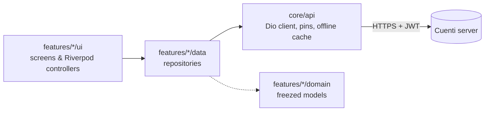

<div align="center">


# Cuenti Mobile

**Your self-hosted finances, in your pocket.**
The Android app for the [Cuenti](https://github.com/13/cuenti) personal-finance server.

[](https://github.com/13/cuenti_mobile/releases/latest)
[](https://github.com/13/cuenti_mobile/actions/workflows/build-apk.yml)


[**Download APK**](https://github.com/13/cuenti_mobile/releases/latest) ·
[Features](#-features) ·
[Getting started](#-getting-started) ·
[Build from source](#%EF%B8%8F-build-from-source) ·
[Architecture](#-architecture)

</div>

<!--
  Screenshots: drop PNGs into docs/screenshots/ and uncomment this block.

<p align="center">
  
  
  
  
</p>
-->

## ✨ Features

<table>
<tr>
<td width="50%" valign="top">

#### 💸 Money
- **Dashboard**: net worth, available cash, portfolio value and every account at a glance
- **Transactions**: add, edit and delete, grouped by month, with account filters, search and saved views
- **Scheduled transactions**: recurring payments you can post or skip
- **Accounts, payees, categories, tags, currencies and assets**: all managed in the app

</td>
<td width="50%" valign="top">

#### 📊 Insights
- **Statistics**: income vs. expense, cash-flow trends and category breakdowns in interactive charts
- **Budgets and forecasts**: see where the month is heading
- **Vehicles**: fuel log and consumption per vehicle
- **Audit log**: who changed what, and when

</td>
</tr>
<tr>
<td valign="top">

#### 🔐 Security
- **Two-factor sign-in** with an authenticator code or a recovery code
- **Biometric lock** when the app returns from the background
- **Certificate pinning**: you trust a self-signed server once, by its fingerprint
- **Encrypted at rest**: credentials sit in the Android keystore; cached data and pending writes are encrypted on the device
- **Privacy mode** hides amounts with one tap

</td>
<td valign="top">

#### 🎨 Everyday comfort
- **Material 3** light and dark themes, following your Cuenti setting or the system
- **English, German and Italian** interface
- **Locale-aware** numbers and dates (e.g. `1.234,56` under `de-DE`)
- **Works offline**: the last data fetched stays readable, and new transactions wait in a queue until the server is back
- **In-app updates** from GitHub Releases, plus data export and import

</td>
</tr>
</table>

## 🚀 Getting started

1. **Download** the latest APK from [Releases](https://github.com/13/cuenti_mobile/releases/latest).
   Most phones want `Cuenti-v<version>-arm64-v8a-release.apk`; the file without an ABI in its name runs everywhere.
2. **Install** it (allow installs from your browser or file manager when Android asks).
3. **Point it at your server** on the *Server Setup* screen, then sign in.

> [!NOTE]
> Two-factor sign-in and background token refresh need **Cuenti server 2.10.23 or later**.
> With an older server the app still works; it just signs in the old way.

Once installed, the app checks GitHub for new releases and offers to update itself.

## 🛠️ Build from source

**Prerequisites:** Flutter 3.47 (Dart ≥ 3.11), Android SDK with API 28+, and JDK 17.

```bash
git clone https://github.com/13/cuenti_mobile.git
cd cuenti_mobile
flutter pub get
flutter run                       # debug build on a connected device or emulator
```

Generated code (`*.g.dart`, `*.freezed.dart`, localisations) is committed. After changing a model, a provider or an `.arb` file, regenerate it:

```bash
flutter gen-l10n
dart run build_runner build
```

<details>
<summary><b>Release APKs</b></summary>

```bash
flutter build apk --release                                                   # universal
flutter build apk --split-per-abi --target-platform android-arm,android-arm64 # per-ABI
```

Output lands in `build/app/outputs/flutter-apk/`. Signing a release build needs a keystore; see [`docs/release-signing.md`](docs/release-signing.md).

</details>

<details>
<summary><b>Running in Android Studio</b></summary>

1. *File → Open…* and pick the `cuenti_mobile` folder. Let Android Studio install any missing SDK parts.
2. *Tools → Device Manager → Create Virtual Device*: a Pixel profile with an API 33+ x86_64 image works well.
3. Pick the device in the toolbar and press **▶ Run** (`Shift+F10`).

> [!TIP]
> On Linux, enable KVM for fast emulation:
> `sudo apt install qemu-kvm && sudo usermod -aG kvm $USER`

</details>

<details>
<summary><b>Checks CI runs (run them before you push)</b></summary>

```bash
dart format --output=none --set-exit-if-changed lib test integration_test tool
flutter analyze
flutter test --coverage
dart run tool/check_coverage.dart 80
```

CI also fails if the committed generated files differ from what the generators produce.

</details>

## 🧱 Architecture



```
lib/
├── main.dart           # entry point, theming, biometric lock
├── router.dart         # go_router routes
├── core/
│   ├── api/            # Dio client, certificate pins, offline cache, reachability
│   ├── storage/        # secure storage, at-rest encryption
│   ├── privacy/        # hide-amounts mode
│   ├── theme/          # Material 3 theme and colours
│   └── widgets/        # shared UI building blocks
├── features/           # one folder per feature, each split into data/ domain/ ui/
│   ├── auth/  dashboard/  transactions/  scheduled/  statistics/
│   ├── budgets/  forecasts/  accounts/  assets/  vehicles/  ...
│   └── app_update/  audit/  saved_views/  user/
├── l10n/               # .arb translations (en, de, it) and generated code
├── screens/            # app shell and navigation
└── utils/              # number, date and chart-label formatting
```

| Concern | Library |
|---|---|
| State | [Riverpod 3](https://riverpod.dev) with code generation |
| Navigation | [go_router](https://pub.dev/packages/go_router) |
| Networking | [Dio](https://pub.dev/packages/dio) |
| Models | [freezed](https://pub.dev/packages/freezed) + json_serializable |
| Charts | [fl_chart](https://pub.dev/packages/fl_chart) |
| Security | flutter_secure_storage, local_auth, cryptography |

## 📦 Releasing

The version lives in `pubspec.yaml` as `version: <name>+<build>`, e.g. `2.9.7+39`. The name is what users see; the build number is Android's `versionCode` and must go up with every release.

```bash
# 1. bump the version in pubspec.yaml
# 2. write what's new for users in docs/release-notes-next.md
git commit -am "release: v2.9.8"
git tag v2.9.8
git push origin main --tags
```

A `v*` tag makes [`build-apk.yml`](.github/workflows/build-apk.yml) test the code, build the universal and arm/arm64 APKs signed with the release key, and publish a GitHub Release. Pushes and pull requests to `main` run the same checks and upload the APK as a workflow artifact.

> [!IMPORTANT]
> A tagged build fails if the release keystore is missing, if the tag doesn't match `pubspec.yaml`, or if `docs/release-notes-next.md` hasn't changed since the previous tag (you may delete the file instead).

## 🔒 Security notes

Cuenti is usually self-hosted behind a self-signed certificate. The app does **not** accept any certificate. The first time you connect to a host whose certificate no trusted CA signed, it shows the certificate's SHA-256 fingerprint so you can compare it with `openssl x509 -fingerprint -sha256`. After you trust it, that host is pinned, and a changed certificate is refused. Certificates from a CA installed in the device's user store are also accepted, so an internal CA works too (see [`network_security_config.xml`](android/app/src/main/res/xml/network_security_config.xml)).

> [!WARNING]
> If you renew your server's certificate, the app will refuse to connect until you trust the new fingerprint.

---

<div align="center">
<sub>Built with Flutter · Companion to <a href="https://github.com/13/cuenti">Cuenti</a> · <a href="#cuenti-mobile">Back to top ↑</a></sub>
</div>
